# Lesion-Focused Diffusion Model for Multiple Sclerosis

<div align="center">
<a href="https://arxiv.org/pdf/2403.14066">📃 Paper</a> |
<a href="https://drive.google.com/drive/folders/1MlfR1vdsgshZRKqquCGAPTKZPvvh_xfA?usp=sharing">🗄️ Data</a> |
<a href="https://huggingface.co/Kate-03/DiffMask_MultipleSclerosis">🤗 DiffMask weights</a> |
<a href="https://api.wandb.ai/links/esneminova-skolkovo-institute-of-science-and-technology/afkpee6c">📉 Wandb</a> |
<a href="https://docs.google.com/presentation/d/1ukql-NkFS7AlMUi8DZa-at7wfHUsEcpNik9AGnjhtGs/edit?usp=sharing">🖥️ Presentation </a> |
<a href="https://github.com/Ne-minus/LeFusion_MultipleSclerosis"> 🤖 Repository </a>
</div>


To run the project ensure that ypu have the following dataset structure:
``` 
├── MsLesSeg_prepaired
    ├── Image
    └── Mask
    └── test.txt ## file with sample names for test
```

### Usage
**DiffMask**  
- train:  
```shell
chmod +x diffmask_train.sh
./diffmask_train.sh
```
- inference:
```shell
chmod +x diffmask_inference.sh
./diffmask_inference.sh
```
**LeFusion**  
- train:  
```shell
chmod +x ms_patches_training_memory_optimized.sh
./ms_patches_training_memory_optimized.sh
```
- inference:
Example is available at Inpainting.ipynb

### Objective and Importance:
The goal of the Lesion-Focused Diffusion Model for Multiple Sclerosis (MS) is to generate realistic MS lesions on healthy MRI scans. This is important because there is limited patient data available, which makes it hard to train models for other MS-related tasks. Generating synthetic lesions helps augment the dataset and improves model performance in MS research and clinical applications.

### Novelty of the Approach:
Unlike traditional methods, our model focuses only on generating lesion masks, not the entire MRI background. It generates masks of MS lesions and fills them with tissue that matches the surrounding healthy brain structure. This approach ensures realistic lesions without altering the healthy tissue.

### Challenges with Existing Models:
Most existing models use patch-based methods, which don’t work well for MS because lesions are spread throughout the brain. Our solution is to train the model using patches containing lesions, teaching it to generate lesion masks and inpaint them with the correct tissue. This allows us to generate realistic lesions on healthy brain scans while keeping the overall brain structure intact.


### Data and its preparation

We use the following datasets for our solution:

1) The **MsLesSeg** dataset, which contains pathological data from 53 patients. This dataset includes full brain MRI scans and corresponding lesion masks.  
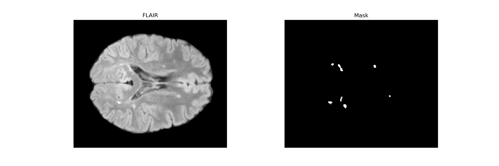
   More elaborate data analysis is available at NeuroProjectResearch.ipynb

3) A **healthy MRI dataset**.

Before training the model, we conducted data analysis. We extracted lesions as connected components and calculated the distribution of lesion volume, the number of lesions per patient, and the bounding sphere radius for each lesion.

| 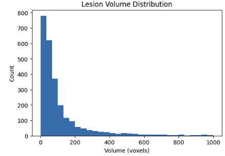 | 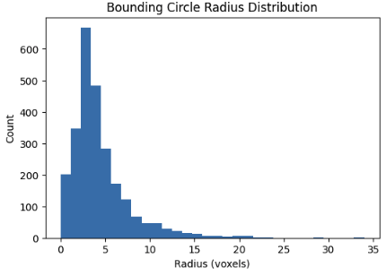 | 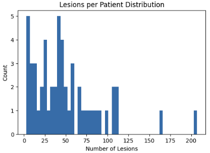 |
|----------|----------|----------|


**Work with data in terms of DiffMask**
1) Crop patches around each lesion:  
   Each patch has a shape of (32, 64, 64). We ensured that no lesions intersect with the patch boundary. In cases where an intersection occurred, the lesion in question was zeroed out.
   Here's some exaples of masks that we crpped:  

| 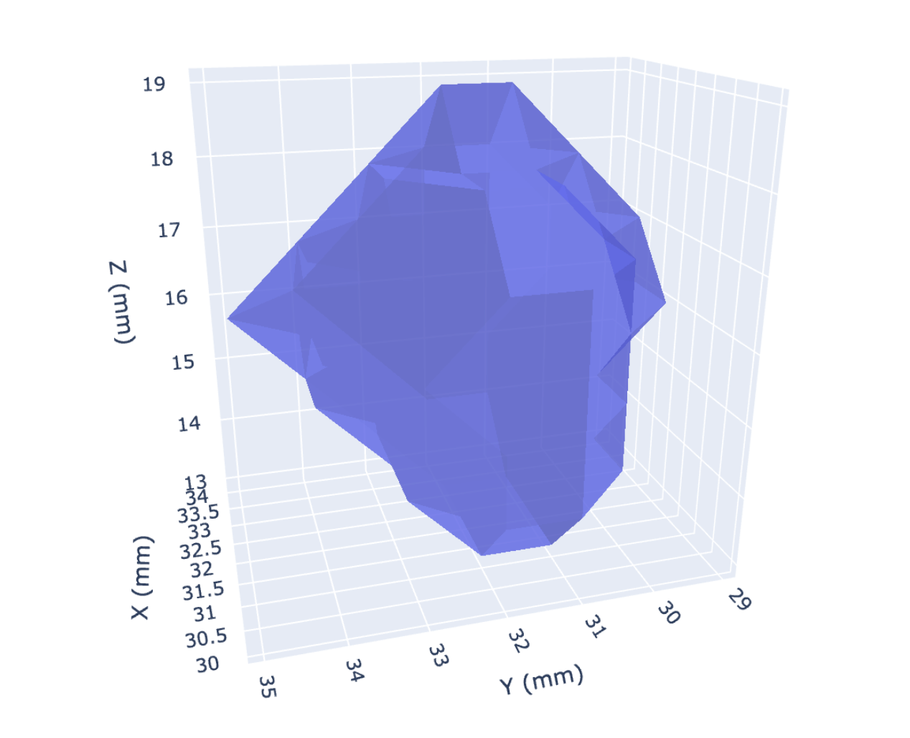 | 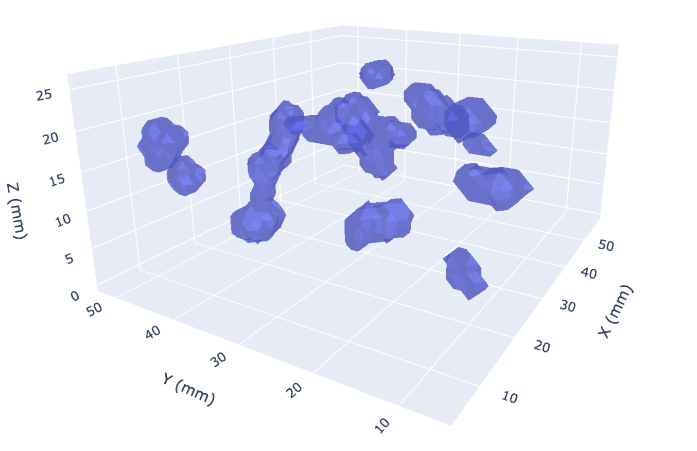 |
|----------|----------|

2) **Crop patches from the original MRI scans**:  useful for consequent LeFusion training
   Below is a 2D mask slice and the corresponding MRI slice. These patches are cropped from the original MRI scans to align with the lesion patches.  
   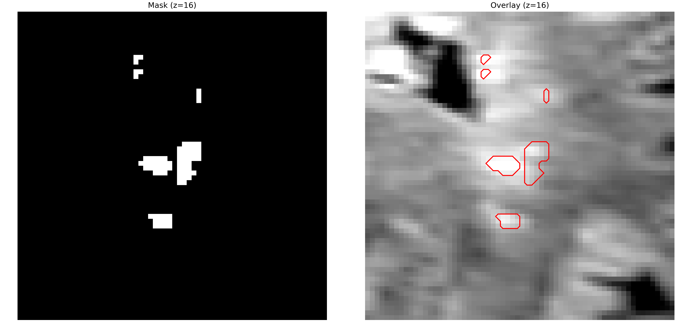

3) For DiffMask,  we follow the authors and use RandomFlip ad transform.No additional data preparation is needed, as we do not use images directly in this model.

### DiffMask pipeline and trainig
Here's the DiffMask architecture. It is diffusion model with control sphere as condition.
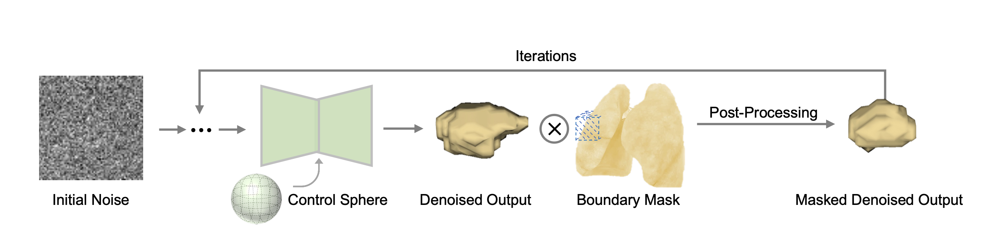

Since authors generate single lesion they use single min_enclosing_sphere. In our case, during the train procedure we contruct separate sphere for each lesion and the combine them to create sphere mask:
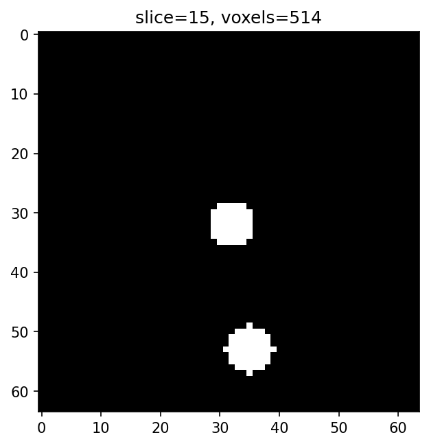

We also modified the loss function in order to concentrate our model on lesion area as following:
```python
if self.loss_type == 'l1':
    loss = F.l1_loss(noise, x_recon)
    # our modification
    loss += 10 * F.l1_loss(noise * (x_start > 0), x_recon * (x_start > 0))
```

During the inference, there is also a need to modify spheres. We conducted research on radius and the volume of each lesion, their total volume and number in single patch:
| 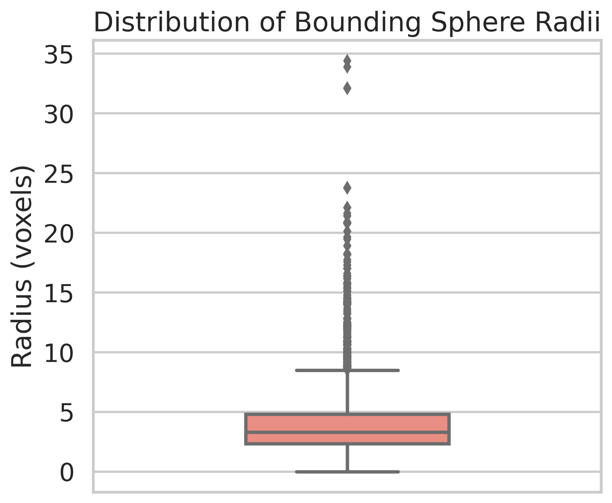 | 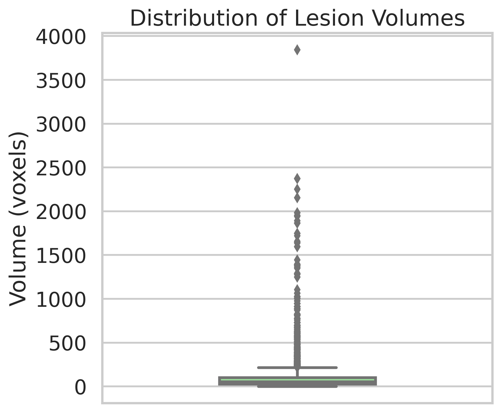 |
|----------|----------|
| 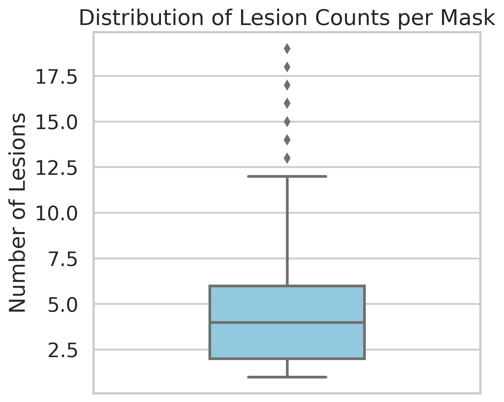 | 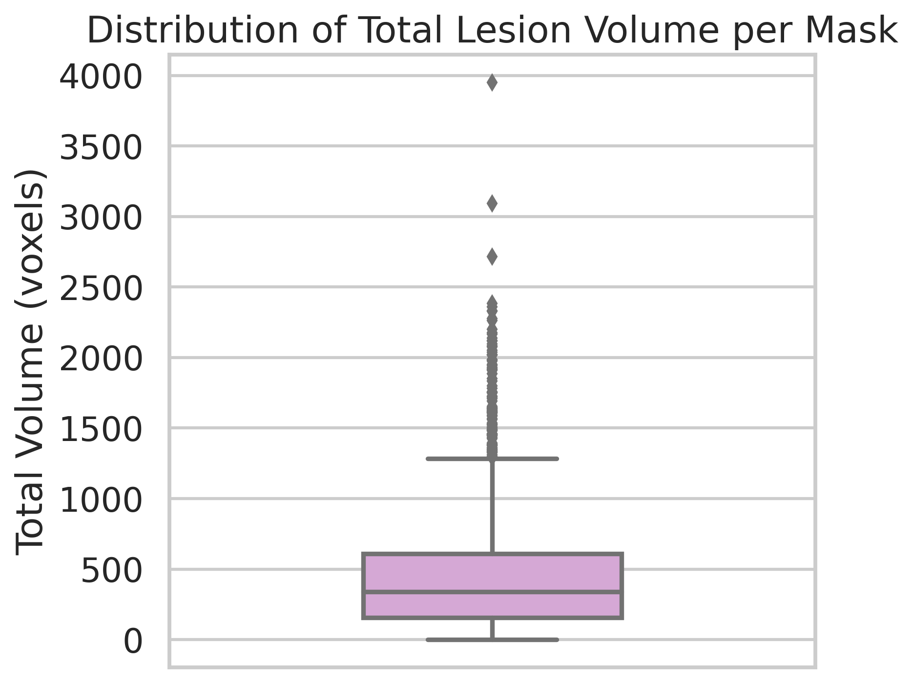 |

Based on this statisctics, the control spheres were calculated:
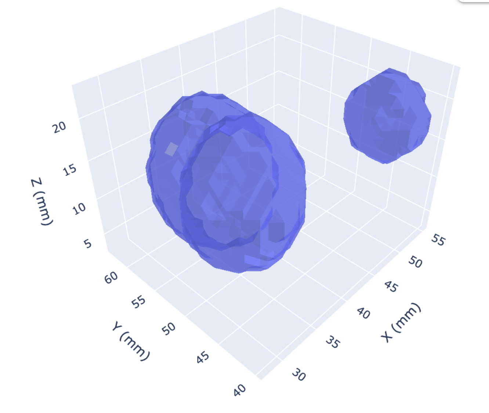

After the generation and smoothing, for each mask we tune the threshold (for our data it is between 0.7 and 0.85) ensure that it's volume and lesion count correspond to the distributtion. We also crop lesions that are to small (less than 50 voxels) and those that intersect with the edges of a patch to obtain:
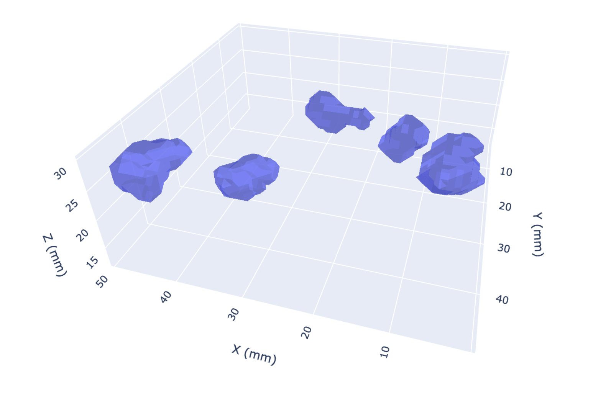


### LeFusion
We used 3D-UNet with attention mechanisms architecture. Total number of parameters ~50M, batch_size 4, gradient accumulation 8 batches. To smooth out the model we applied EMA to model weights. Model was trained for 6200 epochs. Beforehand we adjusted the dataset to handle multiple lesions, code is available at LeFusion. Training loss logs are available at ms_patches_memory_optimized_20251023_115759.log.

Inpainting result after 6200 epochs:

